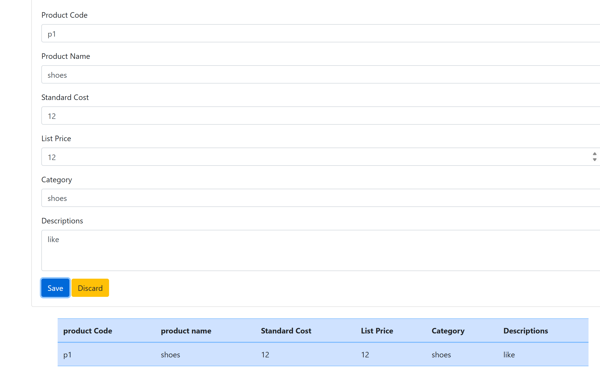
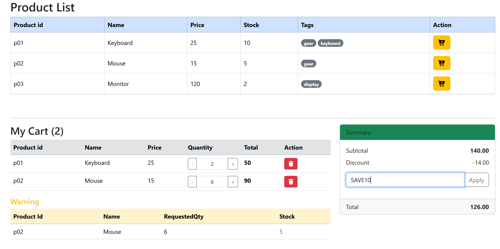

# Table of Contents

- [Problem 1: Add product to table](#problem-1-add-product-to-table)
- [Problem 3: Mini Shopping Cart Engine](#problem-3-mini-shopping-cart-engine)

## Problem 1: Add product to table

Folder: `/webapp`
File: `/webapp/views/product-detail.html` `/webapp/resources/js/product.js`

### Requirements

when click "save" button on product detail page, add the product to the product table on product list page.

### Layout



## Problem 3: Mini Shopping Cart Engine

Folder: `/problem3`
File: `/problem3/src/App.tsx`

### Requirements

#### 1. Implement cart operations (pure functions):

- addToCart(cart, productId, qty = 1)
  - If productId exists, increase its qty.
  - Otherwise add a new item { productId, qty }.
- removeFromCart(cart, productId) removes the item.
- updateQty(cart, productId, qty) updates quantity; if qty <= 0, remove it.

#### 2. Implement summary calculation:

- calcCartSummary(products, cart, ...couponCodes) returns:

```
{
  items: [ { productId, name , qty, price, lineTotal }, ... ],
  subTotal,
  discount,
  total,
  outOfStockItems: [{ productId, name, requestedQty, stock }, ... ]
}
```

##### 3. Coupon rules:

- "SAVE10": 10% off subTotal
- "SHIPFREE": subtract 5 more (shipping discount)
- discount cannot exceed subTotal and total must not be negative

### Layout


